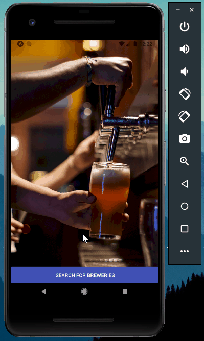

# Find your Beer App
A React Native App that helps you find all kind of bars around the world through a simple search and save them as favorites.

## Getting Started

1. Clone the project.
2. Npm install in the root folder.
3. Expo start.

## Running the app

Run _expo start_ command.

## Built With

* [React Native](https://docs.microsoft.com/en-us/dotnet/framework/winforms/) -  Open-source mobile application framework 
* [Expo](https://expo.io/) - React Native Open-source platform
* [React-Redux](https://react-redux.js.org/) - A predictable state container for JavaScript applications
* [Redux-Sagas](https://redux-saga.js.org/) - Application side effects handler.
* [Axios](https://github.com/axios/axios) - Promise based HTTP client for the browser and node.js

## Try it with Expo

[Expo Project](https://expo.io/@barralex/projects/find-your-beer-app)

## Authors

* **Luis Barral** - *All work* - [Barralex](https://github.com/Barralex)

## License

This project is licensed under the MIT License

## Extra

[Openbrewerydb](https://www.openbrewerydb.org/) Thanks to this guys for they breweries free API.
